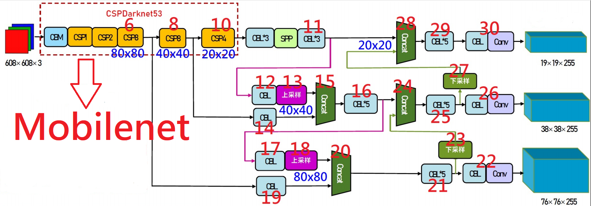
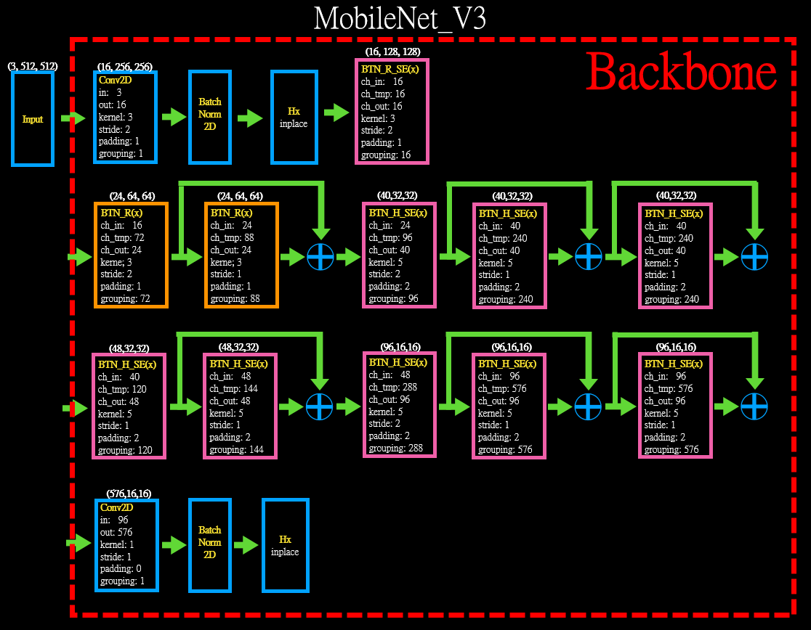
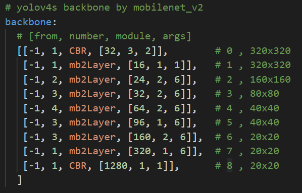
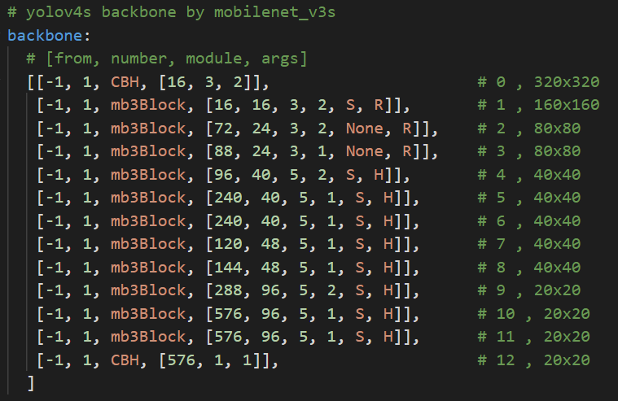
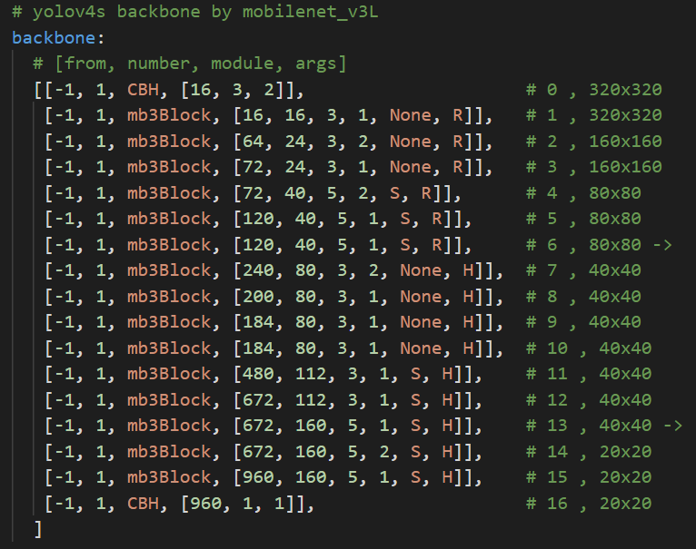
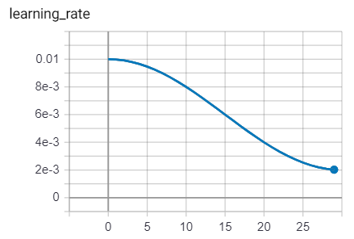
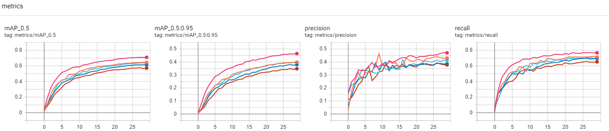
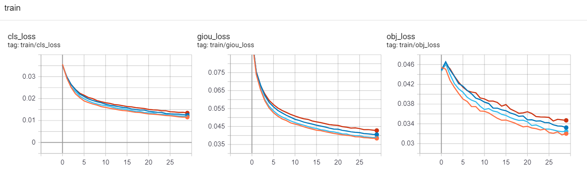
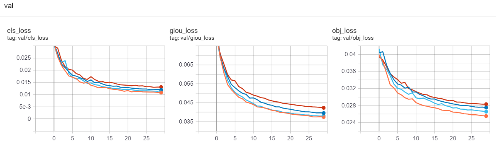

# Yolov4 with MobileNet V2/V3 Backbone
## 目的:
##### 這邊嘗試著以 MobileNet V2/V3 將 Yolov4 的 backbone 做替換來看看會有怎樣的訓練趨勢。
***
## Backbone 替換
Yolov4:  


***
## yaml 檔修改
##### 原始的 Yolov4 yaml 檔案的 backbone

##### 修改後的 Yolov4_L_MobileNet_V2 yaml
  
##### 修改後的 Yolov4_L_MobileNet_V3_small yaml
  
##### 修改後的 Yolov4_L_MobileNet_V3_Large yaml
  
***
## 程式修改 (以 Mobilenet_v3為例)
### yolo.py, parse_model() 增加
```
elif m is CBH:
    c1=ch[f if f<0 else f+1]
    c2=args[0]
    args=[c1,c2,*args[1:]]
elif m is mb3Block:
    c1=ch[f if f<0 else f+1]
    c2=args[1]
    args=[c1,*args]

if m is mb3Block:
    m_=m(*args)
```
### common.py 增加
```
class hswish(nn.Module):
    def forward(self, x):
        out = x * nn.functional.relu6(x + 3, inplace=True) / 6
        return out

class hsigmoid(nn.Module):
    def forward(self, x):
        out = nn.functional.relu6(x + 3, inplace=True) / 6
        return out

class CBH(nn.Sequential):
    def __init__(self, c1, c2, k=1, s=1):  # ch_in, ch_out, kernel, stride, padding, groups
        super(CBH, self).__init__()
        self.conv = nn.Conv2d(c1, c2, k, s, autopad(k, None), bias=False)
        self.bn = nn.BatchNorm2d(c2)
        self.act = hswish()
    def forward(self, x):
        return self.act(self.bn(self.conv(x)))

class mb3SE(nn.Module):
    def __init__(self, in_size, reduction=4):
        super(mb3SE, self).__init__()
        self.se = nn.Sequential(
            nn.AdaptiveAvgPool2d(1),
            nn.Conv2d(in_size, in_size // reduction, kernel_size=1, stride=1, padding=0, bias=False),
            nn.ReLU(inplace=True),
            nn.Conv2d(in_size // reduction, in_size, kernel_size=1, stride=1, padding=0, bias=False),
            hsigmoid()
        )
    def forward(self, x):
        return x * self.se(x)

class mb3Block(nn.Module):
    def __init__(self, c1, cexp, c2, k=1, s=1, se=None, act='H'): #chin, ch_expansion, chout, stride, se, activation
        super(mb3Block,self).__init__()
        self.se=True if se=='S' else False
        if self.se:
            self.sem=mb3SE(c2)
        self.stride=s
        self.conv1 = nn.Conv2d(c1, cexp, kernel_size=1, stride=1, padding=0, bias=False)
        self.bn1 = nn.BatchNorm2d(cexp)
        self.act1 = hswish() if act=='H' else nn.ReLU(inplace=True)
        self.conv2 = nn.Conv2d(cexp, cexp, kernel_size=k, stride=s, padding=k//2, groups=cexp, bias=False)
        self.bn2 = nn.BatchNorm2d(cexp)
        self.act2 = hswish() if act=='H' else nn.ReLU(inplace=True)
        self.conv3 = nn.Conv2d(cexp, c2, kernel_size=1, stride=1, padding=0, bias=False)
        self.bn3 = nn.BatchNorm2d(c2)

        self.shortcut = nn.Sequential()
        if s == 1 and c1 != c2:
            self.shortcut = nn.Sequential(
                    nn.Conv2d(c1, c2, kernel_size=1, stride=1, padding=0, bias=False),
                    nn.BatchNorm2d(c2))

    def forward(self, x):
        out = self.act1(self.bn1(self.conv1(x)))
        out = self.act2(self.bn2(self.conv2(out)))
        out = self.bn3(self.conv3(out))
        if self.se:
            out = self.sem(out)
        out = out + self.shortcut(x) if self.stride==1 else out
        return out
```
***
## parameter 變化量
### 原始的 Yolov4
```
                 from  n    params  module                                  arguments
  0                -1  1       928  models.common.Conv                      [3, 32, 3, 1]
  1                -1  1     18560  models.common.Conv                      [32, 64, 3, 2]
  2                -1  1     20672  models.common.Bottleneck                [64, 64]
  3                -1  1     73984  models.common.Conv                      [64, 128, 3, 2]
  4                -1  1    119936  models.common.BottleneckCSP             [128, 128, 2]
  5                -1  1    295424  models.common.Conv                      [128, 256, 3, 2]
  6                -1  1   1463552  models.common.BottleneckCSP             [256, 256, 8]
  7                -1  1   1180672  models.common.Conv                      [256, 512, 3, 2]
  8                -1  1   5843456  models.common.BottleneckCSP             [512, 512, 8]
  9                -1  1   4720640  models.common.Conv                      [512, 1024, 3, 2]
 10                -1  1  12858368  models.common.BottleneckCSP             [1024, 1024, 4]
 11                -1  1   7610368  models.common.SPPCSP                    [1024, 512, 1]
 
Model Summary: 334 layers, 5.25155e+07 parameters, 5.25155e+07 gradients
```
### 修改後的 Yolov4_MobileNet_v2
```
                 from  n    params  module                                  arguments
  0                -1  1       464  models.common.CBH                       [3, 16, 3, 2]
  1                -1  1       880  models.common.mb3Block                  [16, 16, 16, 3, 2, 'S', 'R']
  2                -1  1      3864  models.common.mb3Block                  [16, 72, 24, 3, 2, None, 'R']
  3                -1  1      5416  models.common.mb3Block                  [24, 88, 24, 3, 1, None, 'R']
  4                -1  1      9808  models.common.mb3Block                  [24, 96, 40, 5, 2, 'S', 'H']
  5                -1  1     27040  models.common.mb3Block                  [40, 240, 40, 5, 1, 'S', 'H']
  6                -1  1     27040  models.common.mb3Block                  [40, 240, 40, 5, 1, 'S', 'H']
  7                -1  1     17304  models.common.mb3Block                  [40, 120, 48, 5, 1, 'S', 'H']
  8                -1  1     19248  models.common.mb3Block                  [48, 144, 48, 5, 1, 'S', 'H']
  9                -1  1     54624  models.common.mb3Block                  [48, 288, 96, 5, 2, 'S', 'H']
 10                -1  1    132096  models.common.mb3Block                  [96, 576, 96, 5, 1, 'S', 'H']
 11                -1  1    132096  models.common.mb3Block                  [96, 576, 96, 5, 1, 'S', 'H']
 12                -1  1     56448  models.common.CBH                       [96, 576, 1, 1]
 13                -1  1   7151616  models.common.SPPCSP                    [576, 512, 1]
  
Model Summary: 294 layers, 2.82702e+07 parameters, 2.82702e+07 gradients
```
### 修改後的 Yolov4_MobileNet_v3_small
```
                 from  n    params  module                                  arguments
  0                -1  1       464  models.common.CBH                       [3, 16, 3, 2]
  1                -1  1       880  models.common.mb3Block                  [16, 16, 16, 3, 2, 'S', 'R']
  2                -1  1      3864  models.common.mb3Block                  [16, 72, 24, 3, 2, None, 'R']
  3                -1  1      5416  models.common.mb3Block                  [24, 88, 24, 3, 1, None, 'R']
  4                -1  1      9808  models.common.mb3Block                  [24, 96, 40, 5, 2, 'S', 'H']
  5                -1  1     27040  models.common.mb3Block                  [40, 240, 40, 5, 1, 'S', 'H']
  6                -1  1     27040  models.common.mb3Block                  [40, 240, 40, 5, 1, 'S', 'H']
  7                -1  1     17304  models.common.mb3Block                  [40, 120, 48, 5, 1, 'S', 'H']
  8                -1  1     19248  models.common.mb3Block                  [48, 144, 48, 5, 1, 'S', 'H']
  9                -1  1     54624  models.common.mb3Block                  [48, 288, 96, 5, 2, 'S', 'H']
 10                -1  1    132096  models.common.mb3Block                  [96, 576, 96, 5, 1, 'S', 'H']
 11                -1  1    132096  models.common.mb3Block                  [96, 576, 96, 5, 1, 'S', 'H']
 12                -1  1     56448  models.common.CBH                       [96, 576, 1, 1]
 13                -1  1   7151616  models.common.SPPCSP                    [576, 512, 1]

Model Summary: 264 layers, 2.57984e+07 parameters, 2.57984e+07 gradients
```
### 修改後的 Yolov4_MobileNet_v3_large
```
                 from  n    params  module                                  arguments
  0                -1  1       464  models.common.CBH                       [3, 16, 3, 2]
  1                -1  1       752  models.common.mb3Block                  [16, 16, 16, 3, 1, None, 'R']
  2                -1  1      3440  models.common.mb3Block                  [16, 64, 24, 3, 2, None, 'R']
  3                -1  1      4440  models.common.mb3Block                  [24, 72, 24, 3, 1, None, 'R']
  4                -1  1      7576  models.common.mb3Block                  [24, 72, 40, 5, 2, 'S', 'R']
  5                -1  1     13960  models.common.mb3Block                  [40, 120, 40, 5, 1, 'S', 'R']
  6                -1  1     13960  models.common.mb3Block                  [40, 120, 40, 5, 1, 'S', 'R']
  7                -1  1     32080  models.common.mb3Block                  [40, 240, 80, 3, 2, None, 'H']
  8                -1  1     34760  models.common.mb3Block                  [80, 200, 80, 3, 1, None, 'H']
  9                -1  1     31992  models.common.mb3Block                  [80, 184, 80, 3, 1, None, 'H']
 10                -1  1     31992  models.common.mb3Block                  [80, 184, 80, 3, 1, None, 'H']
 11                -1  1    114080  models.common.mb3Block                  [80, 480, 112, 3, 1, 'S', 'H']
 12                -1  1    165760  models.common.mb3Block                  [112, 672, 112, 3, 1, 'S', 'H']
 13                -1  1    233632  models.common.mb3Block                  [112, 672, 160, 5, 1, 'S', 'H']
 14                -1  1    247648  models.common.mb3Block                  [160, 672, 160, 5, 2, 'S', 'H']
 15                -1  1    348160  models.common.mb3Block                  [160, 960, 160, 5, 1, 'S', 'H']
 16                -1  1    155520  models.common.CBH                       [160, 960, 1, 1]
 17                -1  1   7544832  models.common.SPPCSP                    [960, 512, 1]
  
Model Summary: 301 layers, 2.71762e+07 parameters, 2.71762e+07 gradients
```
***
## 測試結果
##### 因為coco 圖片集太多，為實驗方便，此處依舊僅取其車輛部分 names: ['motorcycle','car','bus','truck'], 測試結果如下，vgg19效果還遠輸vgg11，可能是太過於肥大，





***
## 參考
[Yolov4](https://github.com/WongKinYiu/PyTorch_YOLOv4)  
[MobileNet_v2](https://pytorch.org/docs/stable/_modules/torchvision/models/mobilenet.html#mobilenet_v2)  
[MobileNet_v3](https://github.com/xiaolai-sqlai/mobilenetv3)
